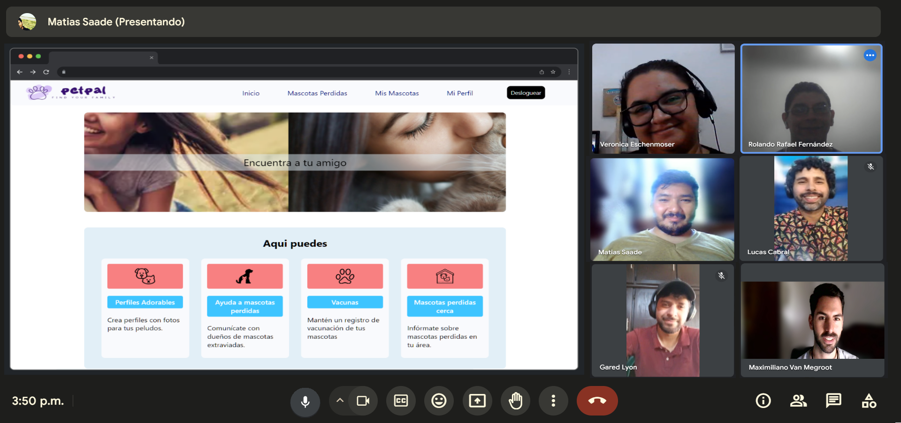

# PetPal

### Sector: Cuidado de mascotas

## Objetivo:

PetPal es una aplicación web diseñada para proporcionar a los dueños de mascotas una
herramienta integral para el cuidado, seguimiento y localización de sus compañeros peludos.
Con el aumento de la preocupación por el bienestar de las mascotas y la necesidad de
mantenerlas seguras, PetPal se presenta como una solución eficiente y fácil de usar.

La pérdida de mascotas es un problema importante a nivel mundial. Se estima que cada
año millones de mascotas se pierden. Los códigos QR pueden ser una herramienta eficaz
para ayudar a encontrar a las mascotas perdidas. PetPal aprovecha esta tecnología al
proporcionar a cada mascota un código QR único que permite acceder a su perfil en la
web y contactar al dueño en caso de extravío.

## Tecnologías:

_Font-End:_ JavaScrypt, React, Zustand, TailwindCSS

_Back-End:_ JavaScrypt, Express, MongoDB, Mocha y Supertest

## Enlaces del Proyecto:

_Repositorio:_ [GitHub](https://github.com/No-Country/c16-17-t-node-react)

_Deploy:_ [Deploy](https://c16-17-t-node-react.web.app/)

_Front-End README:_ [README.md-Front](/client/README.md)

_Back-End README:_ [README.md-Back](/server/README.md)

## Características Principales:

1. **Perfil de Usuario**:

- Los usuarios pueden crear una cuenta con información básica y detalles de sus mascotas.

2. **Perfil de Mascotas**:

- Permite a los usuarios agregar perfiles individuales para cada una de sus mascotas,
  incluyendo características, datos de salud y cuidado.
- Generación de un código QR único para cada mascota, facilitando el acceso a su perfil
  en la web y la comunicación con el dueño en caso de pérdida.

3. **Mascotas Encontradas**:

- Facilita la comunicación entre los dueños de mascotas perdidas y aquellos que las han
  encontrado, ayudando a reunir a las mascotas con sus dueños lo más rápido posible.

Con un enfoque centrado en la experiencia del usuario y la seguridad de las mascotas,
PetPal se posiciona como una herramienta imprescindible para cualquier amante de los
animales que desee brindar el mejor cuidado a sus compañeros peludos.

## Colaboradores:

|                                                                                                                                                           |                                                                                                                                                                                                      |                                                                                                                                                             |                                                                                                                                                                      |                                                                                                                                                                       |
| :-------------------------------------------------------------------------------------------------------------------------------------------------------: | :--------------------------------------------------------------------------------------------------------------------------------------------------------------------------------------------------: | :---------------------------------------------------------------------------------------------------------------------------------------------------------: | :------------------------------------------------------------------------------------------------------------------------------------------------------------------: | :-------------------------------------------------------------------------------------------------------------------------------------------------------------------: |
|                                                                                      |                                                                                                                                 |                                                                                        |                                                                                                |                                                                                                  |
|                                                                      **Gared Lyon**                                                                       |                                                                                         **Rolando Castañon**                                                                                         |                                                                      **Matias Saade**                                                                       |                                                                     **Maximiliano Van_Megroot**                                                                      |                                                                           **Lucas Cabral**                                                                            |
|                                                                      Product Manager                                                                      |                                                                                              Front-End                                                                                               |                                                                          Front-End                                                                          |                                                                               Back-End                                                                               |                                                                              QA Analyst                                                                               |
|                    |                                                               |                         |                                 |                               |
|  |  |  |  |  |
