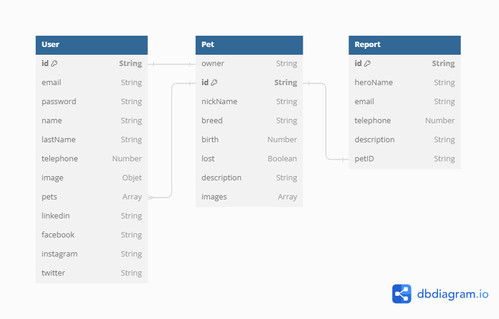

## Back-End:

- Node.js
- JavaScript
- Express
- MongoDB
- Mongoose

# Índice

- [Índice](#índice)
  - [**Primeros pasos**](#primeros-pasos)
    - [Requisitos](#requisitos)
    - [Instalación](#instalación)
  - [**Endpoint Users**](#endpoint-users)
    - [Crear Usuario](#crear-usuario)
    - [Inicio de sesión](#inicio-de-sesión)
    - [Cambio de contraseña](#cambio-de-contraseña)
    - [Obtener usuario especifico](#obtener-usuario-especifico)
    - [Actualizar usuario especifico](#actualizar-usuario-especifico)
    - [Eliminar usuario especifico](#eliminar-usuario-especifico)
  - [**Endpoint Pets**](#endpoint-pets)
    - [Crear Mascota](#crear-mascota)
    - [Obtener mascotas perdidas](#obtener-mascotas-perdidas)
    - [Obtener mascota especifica](#obtener-mascota-especifica)
    - [Reportar mascota encontrada](#reportar-mascota-encontrada)
    - [Actualizar mascota especifica](#actualizar-mascota-especifica)
    - [Eliminar mascota especifica](#eliminar-mascota-especifica)
  - [**Diagrama DB**](#diagrama-db)
  - [**Developers!**](#developers)

Volver al [Índice](#índice)

## **Primeros pasos**

### Requisitos

Asegúrate de tener instalados los siguientes requisitos antes de ejecutar la aplicación:

- **NPM**: Versión >= 10.3.0
- **Node.js**: Versión >= 18.19.0
- **MongoDB**: Asegúrate de tener MongoDB instalado y en ejecución.

### Instalación

1. Clona este repositorio:

- ```bash
  git clone https://github.com/No-Country/c16-17-t-node-react
  ```

2. Navega al directorio del proyecto:

- ```bash
  cd server
  ```

3. Instala las dependencias:

- ```bash
  npm install
  ```

4. Crea un archivo .env con los siguientes parámetros:

- ```env
  PORT=puerto_por_defecto_3001
  MONGO_URL=uri_mongo_db o "mongodb://127.0.0.1:27017/"
  DB_NAME=name_mongoDB_por_defecto_"PetPal"

  MAIL_USERNAME="send@gmail.com"
  MAIL_PASSWORD="password_mail"
  OAUTH_CLIENT_ID="id.apps.googleUserContent.com"
  OAUTH_CLIENT_SECRET="secret_token"
  OAUTH_REFRESH_TOKEN="refresh_token"
  ```

  Mas información en [Nodemailer in Node.js](https://www.freecodecamp.org/espanol/news/como-usar-nodemailer-para-enviar-correos-electronicos-desde-tu-servidor-node-js/)

5. Para realizar tests:

- ```bash
  npm test
  ```

6. Para iniciar la aplicación:

- ```bash
  npm run dev
  ```
  La aplicación estará disponible en http://localhost:3001

Volver al [Índice](#índice)

## **Endpoint Users**

### Crear Usuario

- **`POST /users`** - Registro de nuevos usuario.
- **Params**:
- **Query**:
- **header**:
- **Body**:
  ```javascript
  {
    "email": string - required - Correo electrónico del usuario.
    "password": string - required - Password del usuario.
    "name": string - required - Nombre de usuario.
    "lastName": string - required - Apellido de usuario.
    "telephone": number - optional - Teléfono del usuario.
  }
  ```
- **Request Body** example: Status **201**
  ```javascript
  {
    id: "6570bb7db2ad523394706c12",
    email: "test@gmail.com",
    name: "Maxi",
    lastName: "Van",
    pets: [],
    telephone: null,
    image: {
      id: "String",
      URL: "String",
    },
  }
  ```
  volver al [Índice](#índice)

### Inicio de sesión

- **`POST /users/login`** - Inicio de sesión de usuario.
- **Params**:
- **Query**:
- **header**:
- **Body**:
  ```javascript
  {
    "email": string - required - Correo electrónico del usuario.
    "password": string - required - Password del usuario.
  }
  ```
- **Request Body** example: Status **201**
  ```javascript
  {
  	accessToken: 'eyJhbGciOiJIUzI1NiIsInR5cCI6IkpXVC';
  }
  ```
  volver al [Índice](#índice)

### Cambio de contraseña

- **`POST /users/password`** - Cambio de contraseña. (no implementado)
- **Params**:
- **Query**:
- **header**:
- **Body**:
  ```javascript
  {
    "email": string - required - Correo electrónico del usuario.
    "oldPassword": string - required - Password antigua del usuario.
    "newPassword": string - required - Password nueva del usuario.
  }
  ```
- **Request Body** example: Status **201**
  ```javascript
  {
    "message": "El JWT"
  }
  ```
  volver al [Índice](#índice)

### Obtener usuario especifico

- **`GET /users/:id`** - Obtener detalles de un usuario específico.
- **Params**:
  ```javascript
  "id": string - required - id del usuario.
  ```
- **Query**:
- **header**:
  ```javascript
  Authorization: `Bearer ${token}` string - required - token de acceso.
  ```
- **Body**:
- **Request Body** example: Status **200**
  ```javascript
  {
    id: "6570bb7db2ad523394706c12",
    email: "test@gmail.com",
    name: "Maxi",
    lastName: "Van",
    pets: [],
    telephone: null,
    image: {
      id: "String",
      URL: "String",
    },
  }
  ```

volver al [Índice](#índice)

### Actualizar usuario especifico

- **`PUT /users/:id`** - Actualizar un usuario específico.
- **Params**:
  ```javascript
  "id": string - required - id del usuario.
  ```
- **Query**:
- **header**:
  ```javascript
  Authorization: `Bearer ${token}` string - required - token de acceso.
  ```
- **Body**:
  ```javascript
  {
    "name": string - optional - Nombre de usuario.
    "lastName": string - optional - Apellido de usuario.
    "telephone": number - optional - Teléfono del usuario.
    "image": string - optional - Imagen del usuario.
    "linkedin": string - optional
    "facebook": string - optional
    "instagram": string - optional
    "twitter": string - optional
  }
  ```
- **Request Body** example: Status **200**
  ```javascript
  {
    id: "6570bb7db2ad523394706c12",
    email: "test@gmail.com",
    name: "Maxi",
    lastName: "Van",
    pets: [],
    telephone: null,
    image: {
      id: "String",
      URL: "String",
    },
  }
  ```

volver al [Índice](#índice)

### Eliminar usuario especifico

- **`DELETE /users/:id`** - Eliminar un usuario especifico.
- **Params**:
  ```javascript
  "id": string - required - id del usuario.
  ```
- **Query**:
- **header**:
  ```javascript
  Authorization: `Bearer ${token}` string - required - token de acceso.
  ```
- **Body**:
- **Request Body** example: Status **200**
  ```javascript
  {
    acknowledged: true,
    deletedCount: 1
  }
  ```

Volver al [Índice](#índice)

## **Endpoint Pets**

### Crear Mascota

- **`POST /pets`** - Registro de nueva mascota.
- **Params**:
- **Query**:
- **header**:
  ```javascript
  Authorization: `Bearer ${token}` string - required - token de acceso.
  ```
- **Body**:
  ```javascript
  {
    "nickName": string - required - Nombre de la mascota.
    "breed": string - requires - Raza de la mascota.
    "birth": number - optional - Nacimiento de la mascota.
    "images": array - optional - Imágenes de la mascota.
    "description": string - optional - Descripción de la mascota.
    "lost": boolean - optional - Si el estado es perdido.
  }
  ```
- **Request Body** example: Status **201**
  ```javascript
  {
    id: "65ccbc44a4e9f43e7b4460b4",
    nickName: "Loky",
    owner: "65ccba58e023b17ef6697de1",
    breed: "Golden",
    birth: 0,
    images: [
      {
        id: "String",
        URL: "String",
      }
    ],
    description: "Happy dog",
    lost: false,
  }
  ```

volver al [Índice](#índice)

### Obtener mascotas perdidas

- **`GET /pets/lost`** - Obtener listado de mascotas perdidas con paginado.
- **Params**:
- **Query**:
  ```javascript
  page: number - optional - Número de página (por defecto es 1).
  limit: number - optional - Cantidad de resultados por página (por defecto es 4).
  ```
- **header**:
- **Body**:
- **Request Body** example: Status **200**
  ```javascript
  [
  	{
  		id: '65ccbc44a4e9f43e7b4460b4',
  		nickName: 'Loky',
  		owner: {
  			id: '65ccba58e023b17ef6697de1',
  			name: 'Maxi',
  			telephone: 1234,
  		},
  		breed: 'Golden',
  		birth: 0,
  		images: [
  			{
  				id: 'String',
  				URL: 'String',
  			},
  		],
  		description: 'Happy dog',
  	},
  	// Otros resultados de búsqueda...
  ];
  ```

volver al [Índice](#índice)

### Obtener mascota especifica

- **`GET /pets/:id`** - Obtener detalles de una mascota específica.
- **Params**:
  ```javascript
  "id": string - required - id de la mascota.
  ```
- **Query**:
- **header**:
- **Body**:
- **Request Body** example: Status **200**
  ```javascript
  {
    id: "65ccbc44a4e9f43e7b4460b4",
    nickName: "Loky",
    owner: {
      id: "65ccba58e023b17ef6697de1",
      name: "Maxi",
      telephone: 1234,
      email: "test@gmail.com",
      linkedin: "https://"
      facebook: "https://"
      instagram: "https://"
      twitter: "https://"
      },
    breed: "Golden",
    birth: 0,
    images: [
      {
        id: "String",
        URL: "String",
      }
    ],
    description: "Happy dog",
    lost: false,
  }
  ```

volver al [Índice](#índice)

### Reportar mascota encontrada

- **`POST /pets/report/:id`** - Actualizar una mascota específica.
- **Params**:
  ```javascript
  "id": string - required - id de la mascota.
  ```
- **Query**:
- **header**:
- **Body**:
  ```javascript
  {
    "heroName": string - optional - Nombre del heroe.
    "email": string - optional - Email del heroe.
    "telephone": number - optional - Teléfono del Heroe.
    "description": string - optional - Mas información que ayude.
  }
  ```
- **Request Body** example: Status **200**
  ```javascript
  {
    "message": "Report sent successfully!"
  }
  ```

volver al [Índice](#índice)

### Actualizar mascota especifica

- **`PUT /pets/:id`** - Actualizar una mascota específica.
- **Params**:
  ```javascript
  "id": string - required - id de la mascota.
  ```
- **Query**:
- **header**:
  ```javascript
  Authorization: `Bearer ${token}` string - required - token de acceso.
  ```
- **Body**:
  ```javascript
  {
    "nickName": string - optional - Nombre de la mascota.
    "breed": string - optional - Raza de la mascota.
    "birth": number - optional - Nacimiento de la mascota.
    "images": array - optional - Imágenes de la mascota.
    "description": string - optional - Descripción de la mascota.
    "lost": boolean - optional - Si el estado es perdido.
  }
  ```
- **Request Body** example: Status **200**
  ```javascript
  {
    id: "65ccbc44a4e9f43e7b4460b4",
    nickName: "Loky",
    owner: "65ccba58e023b17ef6697de1",
    breed: "Golden",
    birth: 0,
    images: [
      {
        id: "String",
        URL: "String",
      }
    ],
    description: "Happy dog",
    lost: false,
  }
  ```

volver al [Índice](#índice)

### Eliminar mascota especifica

- **`DELETE /pets/:id`** - Eliminar una mascota específica.
- **Params**:
  ```javascript
  "id": string - required - id de la mascota.
  ```
- **Query**:
- **header**:
  ```javascript
  Authorization: `Bearer ${token}` string - required - token de acceso.
  ```
- **Body**:
- **Request Body** example: Status **200**
  ```javascript
  {
    acknowledged: true,
    deletedCount: 1
  }
  ```

Volver al [Índice](#índice)

## **Diagrama DB**



Volver al [Índice](#índice) Mas [información](https://dbdiagram.io/d/65e9c0afb1f3d4062c5efa2e)

## **Developers!**

### **💻 EXTENSIONES VSC!!** <!-- omit from toc -->

1. **Code Spell Check** (ortografía)
2. **Spanish - Code Spell Checker** (necesita pequeña configuración)
3. **ESLint** (formato de código)
4. **Error Lens** (ver los errores en el código)
5. **Prettier** (se puede configurar para que al guardar formatee automáticamente siguiendo las reglas)

#### **🔄 COMANDOS GIT** <!-- omit from toc -->

- **git remote update origin --prune** estando en main actualiza las ramas
- **git checkout nombre_de_la_rama** cambia de rama
- **git merge --squash origin/main** fusionar la rama fuente con squash
- **git merge origin/main** fusionar la rama fuente con merge
- **git add .** agrega todos los archivos guardados para hacer commit
- **git commit -m "mensaje"** realiza un nuevo commit con un mensaje
- **git commit --amend** modifica el ultimo commit (cambiar archivos y mensaje, en rama propia)
- **git push** sube el commit a la nube
- **git push --force** sube el commit a la nube de manera forzosa, para luego de haber realizado un amend (cuidado! solo en rama propia)
- **git reset --soft HEAD^** deshacer el commit y mantener los cambios en el área de preparación (staging)
- **git reset --mixed HEAD^** deshacer el commit y deshacer los cambios (los cambios se mantienen en tu directorio de trabajo)
- **git reset --hard HEAD^** deshacer el commit y descartar los cambios (eliminar todos los cambios)

Volver al [Índice](#índice)
